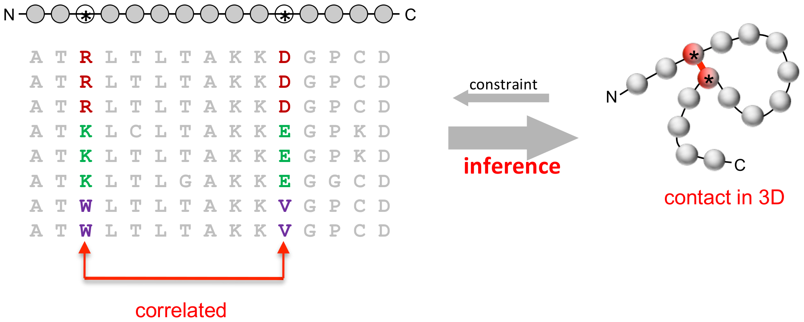
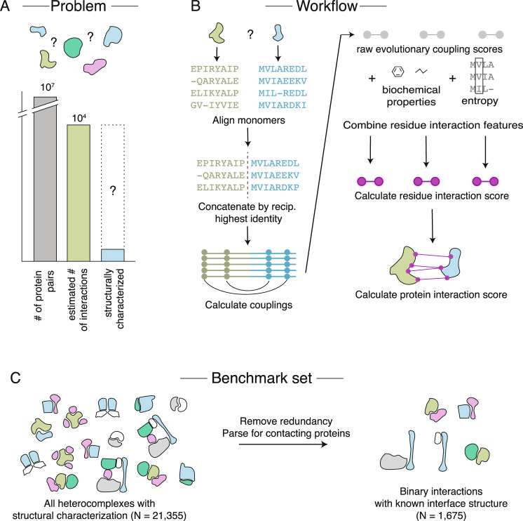
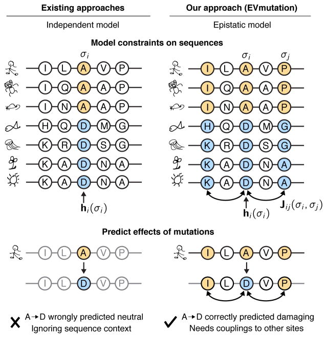

# Modeling co-evolution of amino acid residues: principles and applications

\
## Introduction

Co-evolution of amino acid residues, also called “evolutionary coupling“, is widely used in protein structure prediction, protein-protein interaction (PPI) network, predicting [fitness landscape](https://en.wikipedia.org/wiki/Fitness_landscape) *etc*. This is a very powerful method because the input is just multiple sequence alignment (MSA) of homologous genes, and output provides functional insight of the genes. In addition, it is easy to obtain DNA sequences nowadays nowadays thanks to the high-throughput sequencing technologies, while it is more difficult to obtain functional information such as protein structure, protein-protein interaction, protein-DNA/RNA binding, association between mutation and phenotypes *etc* experimentally. Figure 1 shows the diagram of how to use co-evolution to predict protein structure, Figure 2 shows how to predict PPI, and Figure 3 shows how to construct fitness landscape.

 

 

 

## Predicting protein structure with co-evolution

The key motivating observation is that contacting residues might induce co-evolution. Interestingly, proteins in the same protein family can have only 20-30% sequence identity but have similar structures and functions. Despite the high divergence among members in the same protein family, for an individual protein, randomly introducing mutations is likely to destroy the function of the protein ([Martin Weigt’s talk in Institut Curie](https://www.youtube.com/watch?v=IYA8WEsUcG0&t=1709s)). However, correlated residues might not indicate direct contact, because the correlation can be indirect. Thus, Direct Coupling Analysis is adopted to distinguish direct correlation from indirect correlation ([Marks DS et al, PLoS One. 2011](https://journals.plos.org/plosone/article?id=10.1371/journal.pone.0028766)).  

## Constructing fitness landscape using co-evolution

\

\

## Reference

1. Marks DS, Colwell LJ, Sheridan R, Hopf TA, Pagnani A, Zecchina R, Sander C. Protein 3D structure computed from evolutionary sequence variation. PLoS One. 2011;6(12):e28766.
2. Green AG, Elhabashy H, Brock KP, Maddamsetti R, Kohlbacher O, Marks DS. Large-scale discovery of protein interactions at residue resolution using co-evolution calculated from genomic sequences. Nat Commun. 2021 Mar 2;12(1):1396.
3. Hopf TA, Ingraham JB, Poelwijk FJ, Schärfe CP, Springer M, Sander C, Marks DS. Mutation effects predicted from sequence co-variation. Nat Biotechnol. 2017 Feb;35(2):128-135.
4. Figliuzzi M, Jacquier H, Schug A, Tenaillon O, Weigt M. Coevolutionary Landscape Inference and the Context-Dependence of Mutations in Beta-Lactamase TEM-1. Mol Biol Evol. 2016 Jan;33(1):268-80.

   \

\

\
